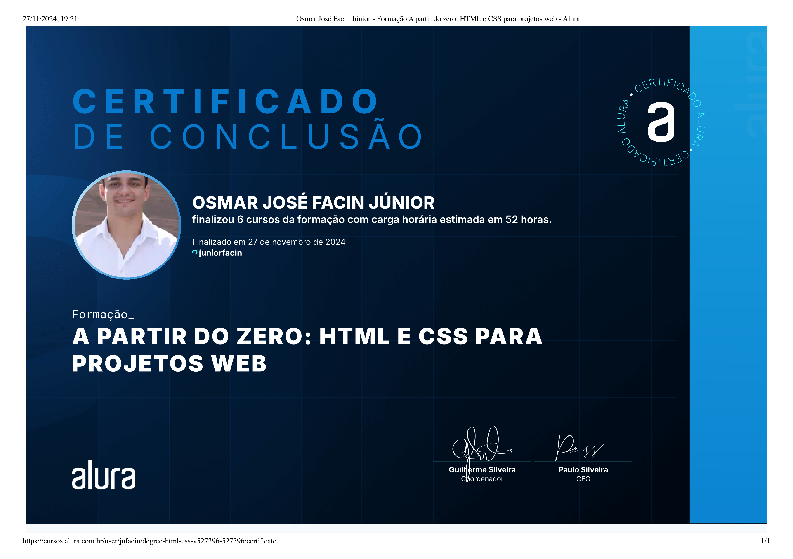

  

## Descrição

 O Projeto AluraBooks faz parte da formação:
 
<a href="https://www.alura.com.br/formacao-html-css" target="_blank">
    <h3 align="center">A partir do zero: HTML e CSS para projetos Web</h3>
</a> 

## Tecnologias
* HTML
* CSS
* JavaScript
* SwiperJS
* Git e GitHub

  
  
  
  
  

## Certificado

